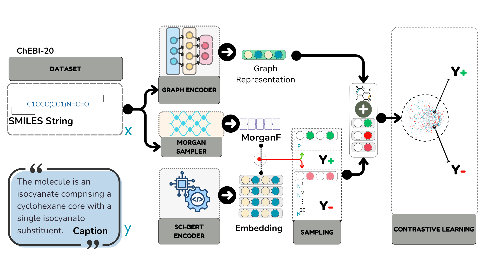

# Semantic Captioning
GAMIC: Graph-Aligned Molecular In-context Learning for Molecule Analysis via LLMs

## Train the model
```
python train.py
```
A checkpoint will be created in the `./checkpoints` folder.

## Create prompt file using the checkpoint created in the training step
```
python assemble_molecule_captioning.py --checkpoint ./checkpoints/mmcl.pt --dataset <chebi-20|pubchem> --method <mmcl|random|zero|gae|scaffold>
```
Input files will be created in the `./input` directory

## Prompt and Measure
```
accelerate launch --main_process_port <PORT>  --num_processes <NUM_GPUs> prompt.py --input_csv <assembed file path> --limit <how many prompts to run> --model_name <mistral-7B|openchat-8B|zephy-7B> 
```

Results will be logged in `EXPERIMENTS.txt` (for molecule captioning) or `EXPERIMENTS_PROP.txt` (for yield/property prediction)



